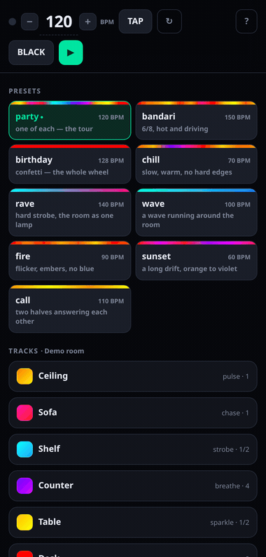
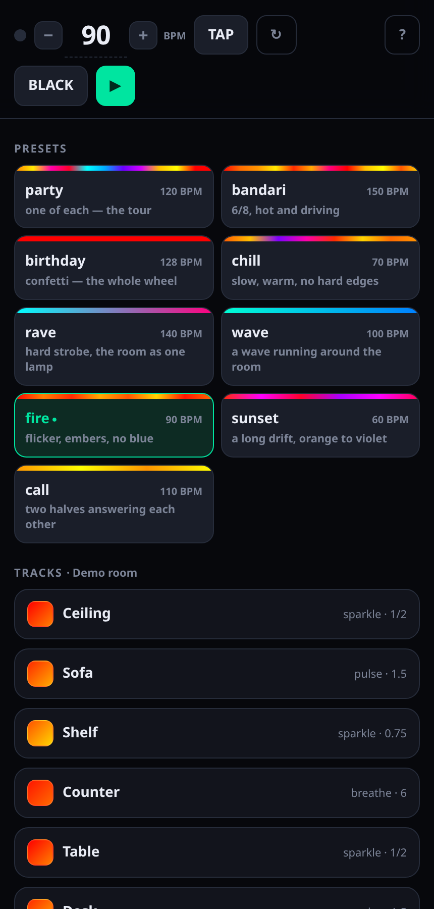
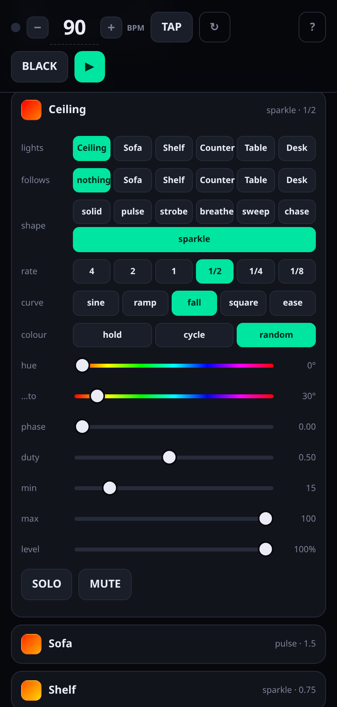
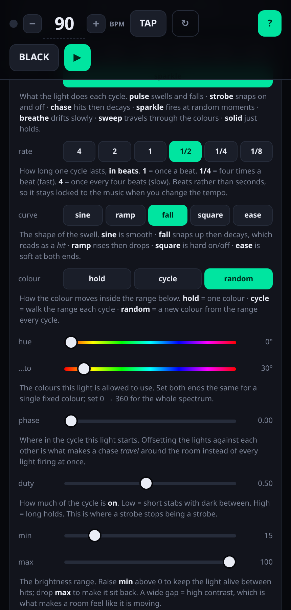
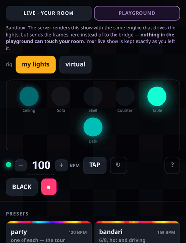
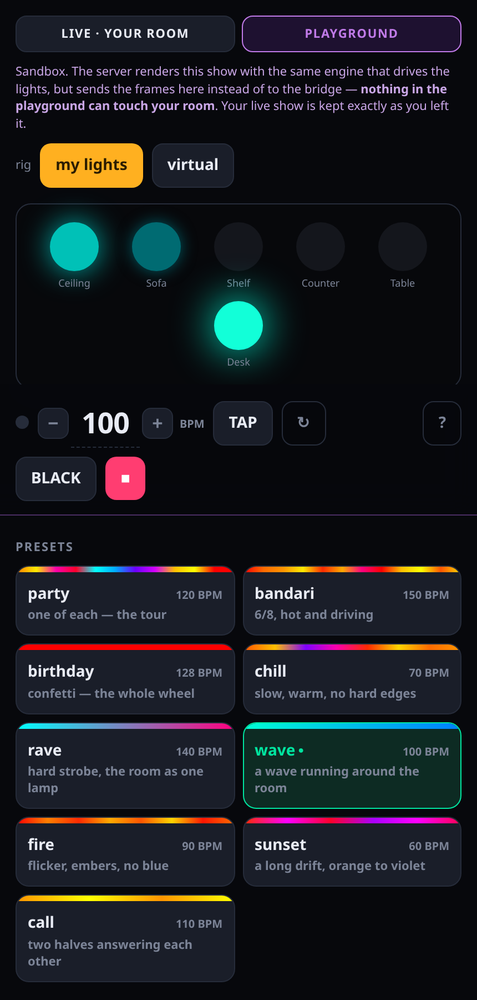

# mirrorball

A light sequencer for Philips Hue. Each light gets a *pattern* — a shape, a rate
in beats, a colour range — and the engine renders them all as a pure function of
the beat, streamed to the bridge at ~50 fps over the Entertainment API.

A mirrorball takes one beam and makes a whole room move. Same idea: one **show**,
dealt onto whatever lights the room happens to have.

It is a sequencer, not a soundboard. You set the lights up once, save the show,
and recall it. See [DESIGN.md](DESIGN.md) for why it is built this way.

<p align="center">
  
</p>

Loading `rave` (every light in one track, in unison), then `call` (the room split
in two, the halves answering each other), then opening a light and pushing the
tempo — note the preset card going amber the moment the show stops being the
preset.

## Why the Entertainment API

The Hue REST API accepts roughly **ten commands a second, shared across every
light**. That is enough to switch a lamp on; it is not enough to make a room
dance. Push past it and the bridge silently drops commands, so effects smear into
a wash and hard hits never land.

The Entertainment API streams over DTLS at **~50 frames a second to every light
at once**. That is the difference between a toy and an instrument: real fades,
draggable faders, strobes that land on the beat.

## Getting started

You need a Hue bridge, at least one light in an **entertainment area** (make one
in the Hue app), Python 3.12+, and `openssl` on the path.

```bash
uv sync
uv run python scripts/register_bridge.py <bridge-ip>   # press the bridge's link button
uv run python -m mirrorball
```

Then open **http://localhost:8090** — phone-friendly, and "Add to Home Screen"
installs it as a PWA.

`register_bridge.py` writes `bridge.json` (gitignored — see
[bridge.example.json](bridge.example.json)): the bridge IP, an app key, and the
**clientkey** the Entertainment stream uses as its DTLS pre-shared key. The
clientkey is only issued *at the moment the app key is created*, so an app key
you already have almost certainly cannot stream — you need a fresh one.

### Configuration

| variable | default | |
|---|---|---|
| `MIRRORBALL_HOST` | `0.0.0.0` | bind address |
| `MIRRORBALL_PORT` | `8090` | port |
| `MIRRORBALL_PASSWORD` | *(none)* | HTTP basic password. Unset means anyone on the LAN can drive the lights. |
| `MIRRORBALL_OPENING` | `party` | the preset the panel opens on |

### No bridge? Run the demo

```bash
uv run python scripts/demo_panel.py     # fake lights, a driver that goes nowhere
```

The whole panel, the whole engine, no hardware — on http://localhost:8091. It is
also what the screenshots here are taken against, so nobody's real light names
end up in the repo:

```bash
cd scripts/shots && npm install
node shoot.mjs         # the panel: stills + gif
node playground.mjs    # the playground: still + gif
```

## The panel

| | | |
|---|---|---|
|  |  |  |
| Presets, with the colours they will actually put in the room | A light's editor: shape, rate, colour range, and the lights it drives | **?** turns on inline help — every control explains itself, in place |

- **▶ / ■** — play, and hand the lights back to the bridge
- **TAP** — tap four times in time with the music; everything locks to that tempo
- **BLACK** — force every light to zero *without stopping*. The show keeps running
  underneath, still on the beat, so releasing it drops you back in *in time*
  rather than restarting. It is the "kill the room for a second" button, not ■.
- **?** — inline help: every control explains itself, in place
- tap any light to set its **shape, rate, colour range, phase** — live, while it plays
- **＋ Track** — build one from a light that is doing nothing. You do not have to
  load a preset and take it apart to start.
- **✕** — delete a track; its lights go back to the unassigned strip
- **Presets** / **My shows** — tap a card to load; fold the sections away when you
  are working in the tracks

Three rules keep the track list honest, and they are worth stating because each
one was a mess before it was a rule:

1. **A light belongs to exactly one track.** Two tracks driving one bulb just
   fight, and whichever rendered last wins — a coin toss dressed up as a feature.
2. **An empty track cannot exist.** It renders nothing and is not a thing in the
   room. Take the last light out and the track goes with it.
3. **A light in no track is unassigned, and says so** — in the open, not hidden as
   an unselected chip inside the editor of a track it has nothing to do with.

## The playground

A sandbox that drives **nothing**. The server renders the show with the same
engine that runs your lights, and sends the frames to the screen instead of the
bridge — so you can build, break and rebuild a show without a single bulb moving.

<p align="center">
  
</p>

<p align="center">
  
</p>

Pick a **rig**:

- **my lights** — mirrors your real room, *same light ids*. A show you build here
  is one you can genuinely play later, so this is a rehearsal room.
- **virtual** — invents up to 24 lamps. Design for a room you do not own, or watch
  what a chase actually does with more lights than you have.

Everything else is the panel you already know: the same presets, the same track
editor, the same tempo. Only the output changes.

### How it is kept away from your lights

The panel drives real lights in someone's home, and that must keep working. So
the isolation is **structural**, not a matter of being careful:

- The playground has **no driver**. It never constructs one, so there is nowhere
  for a frame to go — it cannot open the DTLS socket or claim the entertainment
  area even if the code above it is wrong.
- It owns a **separate Show, clock and rig**. Nothing it does can reach the live
  show or the engine, and switching modes leaves each side exactly as you left it.
- Its messages live in their own **`pg.*` namespace**, handled by a function that
  is never given the live show. One choke point in the panel decides the
  namespace, so a sandbox edit cannot address the room by accident.
- A **virtual show cannot be saved**. It names lights that do not exist, so saving
  it would hand you a show that loads fine and then lights nothing. It is refused
  at the door.

What it *does* share is `render_show` — the preview is produced by the exact code
that drives the bridge. A second renderer written in JavaScript would look right
and then quietly drift.

The tests pin the isolation rather than the features: break the panel's choke
point and `NOTHING addresses the live show from the playground` fails immediately.

## Groups and links

Setting six lights one at a time is tedious, and the interesting ideas are all
*relationships*. Two things cover it.

**A track drives a set of lights.** Tap lights in or out of a track — two or more
is a **group**, and they share a pattern. A light belongs to exactly one track;
adding it here takes it from wherever it was. (Two tracks driving one bulb would
just fight, and whichever rendered last would win.)

**`spread` decides what a group means.** At *unison* every light in the group
does the same thing at the same instant — the group becomes one big lamp. Turn it
up and each light sits a little further round the cycle, so the pattern
**travels** through them. `rave` and `wave` are the same layout with one number
different.

**A track can follow another.** It inherits the leader's **pattern** — shape,
curve, rate, duty, colour — and keeps its own **placement** — lights, spread,
brightness, level, phase. Then it can differ:

| | |
|---|---|
| **speed** | ×½ / ×2 — the echo at half or double time |
| **invert** | bright exactly where the leader is dark |
| **hue ±** | rotate its colour; 180° is the opposite side of the wheel |
| **phase** | answer half a beat later |

Change the leader and the follower changes with it. The `call` preset is the
demo: the room splits in two and the halves argue.

**Linking is one level deep** — a follower follows its leader's *own* pattern,
never the leader's leader. That is a real constraint, chosen because it makes a
cycle impossible *by construction* rather than by a visited-set check somebody
has to remember to keep correct.

## Presets

Nine ship with mirrorball: `party` `bandari` `birthday` `chill` `rave` `wave`
`fire` `sunset` `call`. Tap one and it loads — including while a show is playing,
which swaps the lights over without a gap.

A preset is **not** a saved show. A saved show names the lights it drives, and
those ids belong to one installation; a preset is a list of *voices* ("first
light does a hot chase, second answers with a strobe") that get dealt onto
whatever lights the entertainment area actually has, cycling if there are more
lights than voices. So presets work on any bridge, and nothing
installation-specific ends up in the repo.

A preset also says how its voices meet the room: **each** (one track per light),
**all** (every light in one track — `rave` in unison, `wave` travelling), or
**split** (one group per voice, which is how `call` gets two halves to argue).

Add one by adding an entry to `PRESETS` in `mirrorball/core/presets.py`. There is
nothing else to touch, and a test builds every preset against 1, 6 and 12 lights
to make sure it still renders.

A preset is a starting point, not a straitjacket: load one, change it, name it,
Save. It lands in `shows/` as your own show and the preset stays pristine.

## Deploying to a Raspberry Pi

It is happiest on a machine that is always on. It ships as a container:

```bash
docker compose up -d --build            # on the host itself
MIRRORBALL_SSH=pi ./scripts/deploy.sh   # or push it from a laptop
```

`bridge.json` and `shows/` are bind-mounted from the host, never baked into the
image — so credentials stay out of the repo and saved shows survive a rebuild.

While a show is playing, the bridge gives mirrorball **exclusive ownership** of
the entertainment area, and nothing else can drive those lights. Pressing ■ hands
them straight back.

## Tech stack

| | |
|---|---|
| **Language** | Python 3.12, `uv` for deps and lockfile |
| **Core** | pure functions — a show is rendered *from the beat*, with no accumulated state |
| **Model** | pydantic — a `Show` is a JSON document, and validation is the schema |
| **Server** | FastAPI + uvicorn, one WebSocket |
| **Lights** | Hue **Entertainment API** — UDP, DTLS-PSK, ~50 fps |
| **DTLS** | `openssl s_client` as a subprocess (see below) |
| **Discovery** | Hue REST (CLIP v2) over aiohttp — only to ask what lights exist |
| **Panel** | plain HTML/CSS/JS, no framework, no build step — a PWA you can install |
| **Logs** | loguru · **Lint** ruff · **Tests** pytest + jsdom |
| **Ships as** | Docker, `restart: unless-stopped` |

Three decisions carry the design:

**Rendering is a pure function of the beat.** `render(track, beat) -> Frame` — no
state carried between frames. Replay beat 4 an hour later and you get the same
frame. The effects this replaces broke the other way: brightness accumulated
frame to frame until the contrast washed out. It also means the entire core is
testable without a bridge, a light, or a `sleep`.

**Rates are in beats, not seconds.** Change the tempo and the whole show moves
together, because nothing was ever measured in wall-clock time.

**The panel is disposable.** It edits a `Show` and sends it over the socket; it
never touches a light. A native app later is a new view over the same protocol,
not a rewrite.

## Notes for the next person

- **openssl is the DTLS stack**, not a convenience. Frames are piped through
  `openssl s_client`. `python-mbedtls` was tried first: its DTLS handshake has no
  retransmission timer, so if the bridge's first flight is late it blocks
  **forever** — no error, no timeout. It worked twice and then never again, which
  looks exactly like a broken bridge and is not. See `mirrorball/drivers/dtls.py`.
- **Always `stop` before `start`** on an entertainment area. A streamer that went
  away can leave the area stuck `active`, and the bridge will then accept your
  `start` with a cheerful `200 OK` and never open the UDP port.

## Tests

```bash
uv run pytest         # the core is pure: no bridge, no lights, no sleeping
./scripts/test-ui.sh  # the panel, driven in jsdom (installs jsdom on first run)
```

The UI tests load the **real** `index.html` and `app.js` and drive them through a
fake WebSocket. That is the point: every panel bug so far has lived in the seam
between the panel and the socket, and a test that mocked either side would have
missed all of them.

The one that keeps coming back: **the server broadcasts the whole show ten times
a second, and if the panel takes those echoes it undoes whatever the user is
doing right now.** It ate the sliders (the dragged element was destroyed and
replaced mid-drag, and the value snapped back) and then the tempo (a typed bpm
was overwritten by the server's clock). So the fixtures deliberately echo a
*stale* show, and the tests assert the panel's own value survives.

The panel owns the Show. The server's copy is adopted exactly twice: at connect,
and when the panel asks for one (a load). Plus the bpm, but only right after a
TAP — because there the server did the measuring.

Two suites are there to pin things that are *invisible* when they break, which is
the worst kind of bug in a light show:

- **solo** — a solo silences every other track. It used to be *saved into shows*,
  so a show recalled a week later came back with one track soloed and the rest
  dark. It looked exactly like "grouping broke my show". Solo is monitoring state
  now: stripped on save, stripped on load, and impossible to miss while it is on.
- **playground** — the sandbox must never reach the lights. The test asserts that
  in playground mode *nothing* addresses the live show, and it fails the moment
  the panel's namespace choke point is broken.

## Licence

MIT — see [LICENSE](LICENSE).
